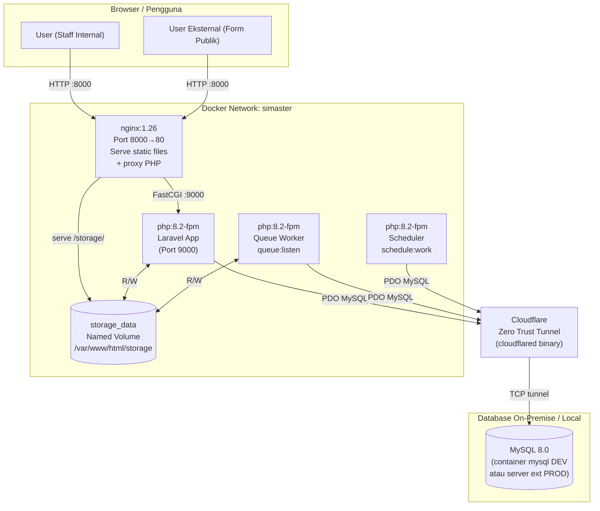
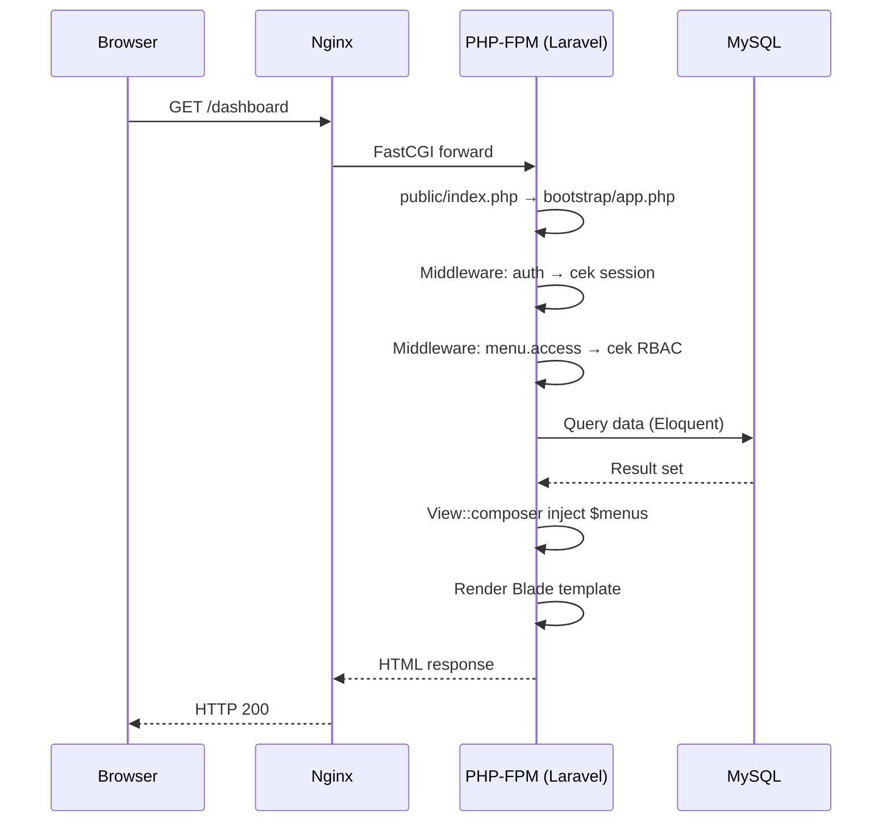
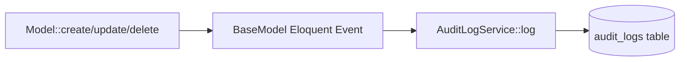
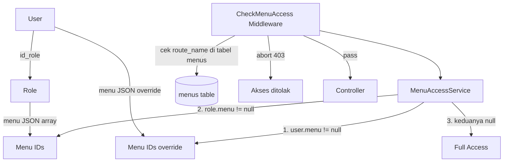

# 02 — Arsitektur Sistem

## Diagram Arsitektur (Production)



> **Dev vs Prod:**  
> - **Dev** (`docker-compose.yml`): MySQL berjalan sebagai container `mysql` di network yang sama. `CF_ACCESS_CLIENT_ID` tidak diset → cloudflared tidak dijalankan, `DB_HOST=mysql`.  
> - **Prod** (`docker-compose.prod.yml`): Tidak ada container MySQL. Database di server on-premise. `DB_HOST=127.0.0.1` karena cloudflared membuat TCP proxy lokal.

---

## Komponen & Fungsinya

| Komponen | File / Image | Tanggung Jawab |
|---|---|---|
| **Nginx** | `docker/nginx.conf`, image `nginx-stage` | Menerima request HTTP, serve `public/build/` (assets) dan `storage/` (file upload), forward PHP ke php-fpm |
| **PHP-FPM App** | `Dockerfile` target `runtime` | Menjalankan Laravel — routing, controller, Eloquent, render view |
| **Queue Worker** | Container `worker`, command `queue:listen` | Memproses job asinkron dari tabel `jobs` (database driver) |
| **Scheduler** | Container `scheduler`, command `schedule:work` | Menjalankan cron Laravel — saat ini hanya `rekap:bulanan` tiap tgl 1 jam 00:00 |
| **MySQL** | `mysql:8.0` / server eksternal | Penyimpanan data utama — semua tabel transaksional, session, queue, cache |
| **Named Volume `storage_data`** | Docker volume | Persists file upload (foto aset, struk, dokumen) agar tidak hilang saat image di-rebuild |
| **Cloudflare Zero Trust** | `cloudflared` binary di image | Membuat tunnel terenkripsi dari container ke MySQL on-premise (tanpa expose port DB ke internet) |

---

## Alur Request HTTP



---

## Struktur Folder

```
manajemen-aset/
├── app/
│   ├── Console/Commands/     ← Artisan commands (RekapBulanan)
│   ├── Exports/              ← Kelas export Excel (Maatwebsite) & PDF helper per-modul
│   ├── Http/
│   │   ├── Controllers/      ← ~30 controller, 1 file per modul
│   │   └── Middleware/       ← CheckMenuAccess (RBAC)
│   ├── Models/               ← ~57 Eloquent model, semua extend BaseModel
│   ├── Observers/            ← UserObserver
│   ├── Providers/            ← AppServiceProvider (View::composer untuk $menus)
│   ├── Services/             ← MenuAccessService, AuditLogService, AsetLogService
│   └── helpers.php           ← Global helper functions
├── bootstrap/
│   └── app.php               ← Entry config Laravel: routing, middleware alias, schedule
├── config/
│   ├── coa.php               ← Chart of Accounts (kategori anggaran bertingkat)
│   └── *.php                 ← Config standar Laravel (database, queue, cache, dll)
├── database/
│   ├── migrations/           ← ~60 migration file (additive-only di production)
│   ├── seeders/              ← Seeder untuk data awal (role, menu, superadmin)
│   └── database.sqlite       ← Database dev lokal (SQLite)
├── docker/
│   ├── entrypoint.sh         ← Init: cloudflared → storage → migrate → cache → php-fpm
│   └── nginx.conf            ← Konfigurasi Nginx (upload 64MB, cache static, proxy PHP)
├── docs/                     ← Dokumentasi teknis ini
├── public/
│   ├── index.php             ← Entry point web (satu-satunya PHP yang di-hit langsung)
│   └── build/                ← Output Vite (CSS/JS ter-bundle + hash nama file)
├── resources/
│   ├── css/                  ← styles.css (custom) + app.css (Tailwind)
│   ├── js/                   ← app.js + modul JS kustom
│   ├── sass/                 ← SCSS files
│   └── views/                ← Blade templates, 1 subfolder per modul
├── routes/
│   └── web.php               ← Semua route (publik + auth-protected)
├── storage/
│   ├── app/public/           ← File upload (symlink dari public/storage)
│   ├── framework/            ← Cache view, session, compiled routes
│   └── logs/                 ← Laravel log files
├── tests/
│   ├── Feature/              ← Feature tests (ApprovalWorkflowTest)
│   └── Unit/                 ← Unit tests (placeholder)
├── Dockerfile                ← Multi-stage build: assets → runtime → nginx-stage
├── docker-compose.yml        ← Dev: 5 services + MySQL container
└── docker-compose.prod.yml   ← Prod: 4 services, tanpa MySQL (eksternal via CF tunnel)
```

---

## Pola Desain

### MVC + Service Layer

```
HTTP Request
    ↓
Route (routes/web.php)
    ↓
Middleware (auth, menu.access)
    ↓
Controller (app/Http/Controllers/)
    ├── Service calls (MenuAccessService, AuditLogService, AsetLogService)
    ├── Model (app/Models/) — Eloquent ORM
    │     └── BaseModel.booted() → AuditLogService (otomatis setiap CRUD)
    └── View (resources/views/) ← AppServiceProvider inject $menus via View::composer
```

### BaseModel & Audit Otomatis

Semua model (kecuali `AuditLog` sendiri) extend `BaseModel` ([`app/Models/BaseModel.php`](../app/Models/BaseModel.php)). `BaseModel::booted()` mendaftarkan Eloquent event listener untuk `created`, `updated`, `deleted` yang otomatis memanggil `AuditLogService::log()`.



### RBAC (Role-Based Access Control)



**Hirarki akses** (`app/Services/MenuAccessService.php`):
1. Jika `user.menu != null` → pakai override individual
2. Jika `role.menu != null` → pakai menu dari role
3. Jika keduanya `null` → **full access** (khusus superadmin tanpa pembatasan)

Middleware `menu.access` di-alias di `bootstrap/app.php` → `App\Http\Middleware\CheckMenuAccess`.

---

## Modul-Modul Utama

| Modul | Controller | Model Utama |
|---|---|---|
| **Infrastruktur** | `GedungController`, `RuanganController` | `Gedung`, `Ruangan`, `GedungGambar`, `GedungDenah`, `RuanganGambar` |
| **Aset Inventaris** | `AsetController` | `Aset`, `AsetLog`, `JenisBarang` |
| **APAR** | `AparController` | `Apar`, `AparLog` |
| **Kendaraan** | `KendaraanController` | `Kendaraan` |
| **Gudang** | `GudangController` | `GudangBarang`, `GudangTransaksi`, `GudangTransaksiDetail`, `GudangTransaksiCharge`, `GudangRekapBulanan`, `GudangOpnameHeader`, `GudangOpnameDetail` |
| **Peminjaman** | `PeminjamanAsetController`, `PeminjamanRuanganController` | `PeminjamanAset`, `PeminjamanAsetDetail`, `PeminjamanRuangan`, `PeminjamanRuanganDetail`, `PeminjamanRuanganAset`, `PeminjamanRuanganKonsumsi` |
| **Permintaan & Pengadaan** | `PermintaanBarangGudangController`, `PengadaanBarangJasaController` | `PermintaanBarangGudang`, `PengadaanBarangJasa`, `PengadaanBarangJasaDetail`, `PengadaanBarangJasaFile` |
| **Kendaraan (Permintaan)** | `PermintaanKendaraanController` | `PermintaanKendaraan`, `PermintaanKendaraanDetail`, `PermintaanKendaraanItem` |
| **Pemindahan** | `PemindahanAsetController` | `PemindahanAset`, `PemindahanAsetDetail` |
| **Ekspedisi** | `EkspedisiController` | `Ekspedisi`, `EkspedisiBarang`, `EkspedisiDokumen`, `EkspedisiPengiriman` |
| **Pengaduan Kerusakan** | `PengaduanKerusakanController` | `PengaduanKerusakan`, `PengaduanKerusakanDetail` |
| **Maintenance** | `MaintenanceController` | `Maintenance`, `MaintenanceDetail` |
| **Pemusnahan** | `LaporanPemusnahanController` | `LaporanPemusnahan` |
| **Laporan Tahunan** | `LaporanTahunanController` | `LaporanTahunan`, `LaporanTahunanDetail`, `LaporanTahunanSummary` |
| **Anggaran RKAT** | `AnggaranController` | `RkatAnggaran`, `RkatRealisasi` |
| **Admin** | `UserController`, `RolesController`, `MenuController` | `User`, `Role`, `Menu` |
| **Audit** | `AuditLogController` | `AuditLog` |
| **Vendor** | `VendorController` | `Vendor` |
