# 03 — Alur Sistem per Modul

Semua modul transaksional mengikuti pola yang sama. Bagian ini mendokumentasikan alur tiap modul beserta diagram sekuens.

---

## Pola Umum Modul Transaksional

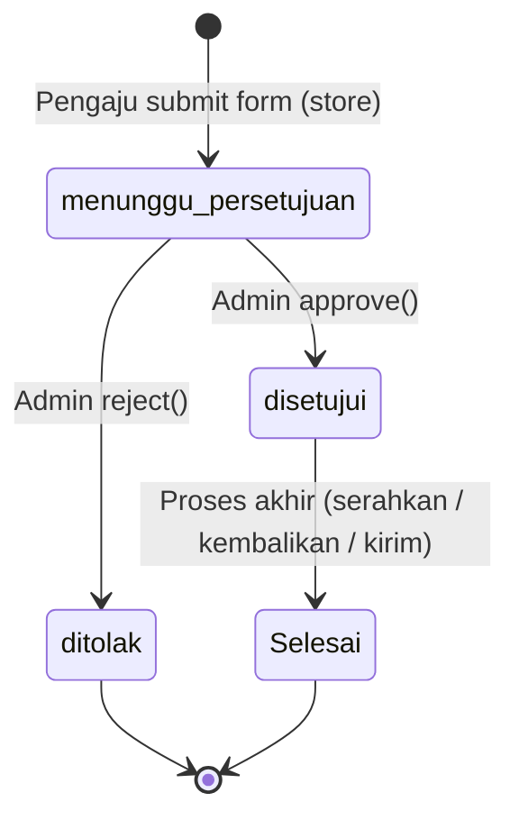

Dua field status selalu ada di tabel transaksional:
- **`decision_status`**: `menunggu_persetujuan` → `disetujui` / `ditolak`
- **`status`**: `Belum Diproses` → `Sedang Diproses` → `Selesai`

---

## 1. Peminjaman Aset

**Controller**: `PeminjamanAsetController`  
**Model**: `PeminjamanAset`, `PeminjamanAsetDetail`  
**Route prefix**: `/peminjaman-aset`

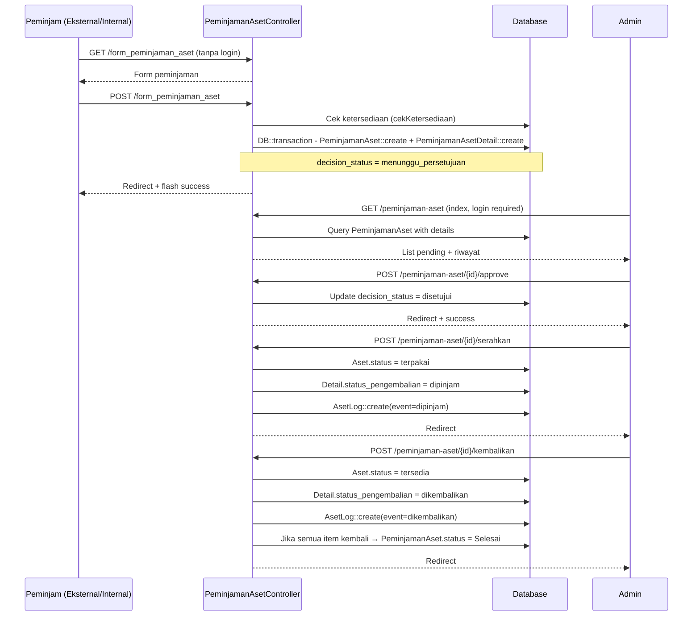

**Endpoint AJAX**: `GET /cek-ketersediaan` — hitung unit tersedia di rentang tanggal tertentu (pakai `lockForUpdate()` saat `store`).

---

## 2. Peminjaman Ruangan

**Controller**: `PeminjamanRuanganController`  
**Model**: `PeminjamanRuangan`, `PeminjamanRuanganDetail`, `PeminjamanRuanganAset`, `PeminjamanRuanganKonsumsi`

Alur sama dengan Peminjaman Aset, dengan tambahan:
- Detail bisa menyertakan daftar **aset yang ada di ruangan** (`PeminjamanRuanganAset`)
- Bisa menyertakan **konsumsi** (snack, minuman) via `PeminjamanRuanganKonsumsi`
- Endpoint AJAX: `GET /cek-ketersediaan-ruangan`

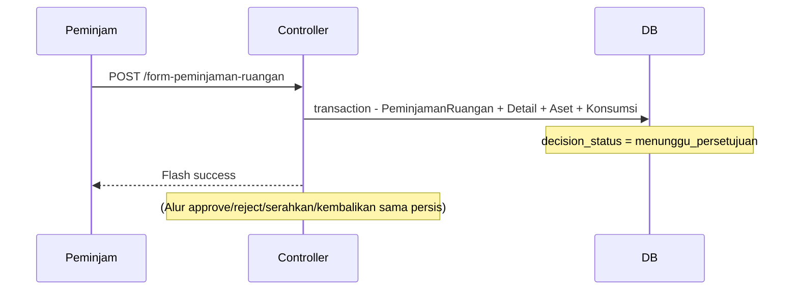

---

## 3. Permintaan Barang Gudang

**Controller**: `PermintaanBarangGudangController`  
**Model**: `PermintaanBarangGudang`  
**Alur khas**: Setelah disetujui, barang diambil dari stok gudang.

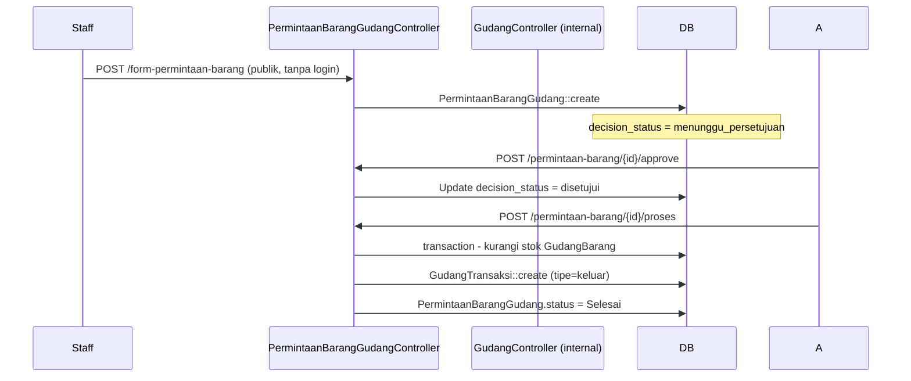

---

## 4. Pengadaan Barang/Jasa (Pembelian ke Vendor)

**Controller**: `PengadaanBarangJasaController`  
**Model**: `PengadaanBarangJasa`, `PengadaanBarangJasaDetail`, `PengadaanBarangJasaFile`

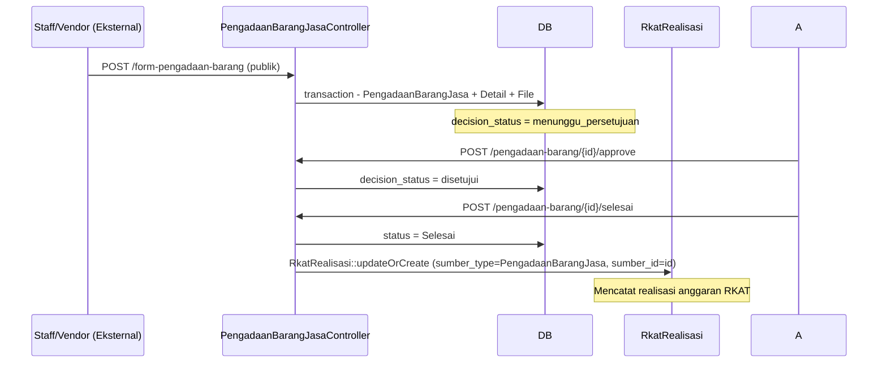

File upload (struk, invoice) disimpan ke `storage/app/public/pengadaan/`.

---

## 5. Permintaan Kendaraan

**Controller**: `PermintaanKendaraanController`  
**Model**: `PermintaanKendaraan`, `PermintaanKendaraanDetail`, `PermintaanKendaraanItem`

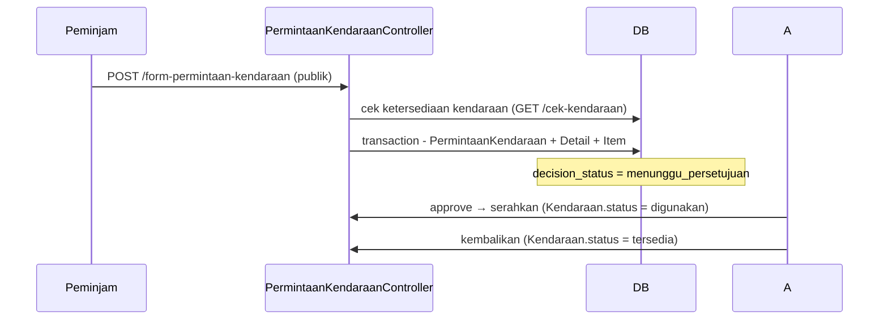

---

## 6. Pemindahan Aset

**Controller**: `PemindahanAsetController`  
**Model**: `PemindahanAset`, `PemindahanAsetDetail`

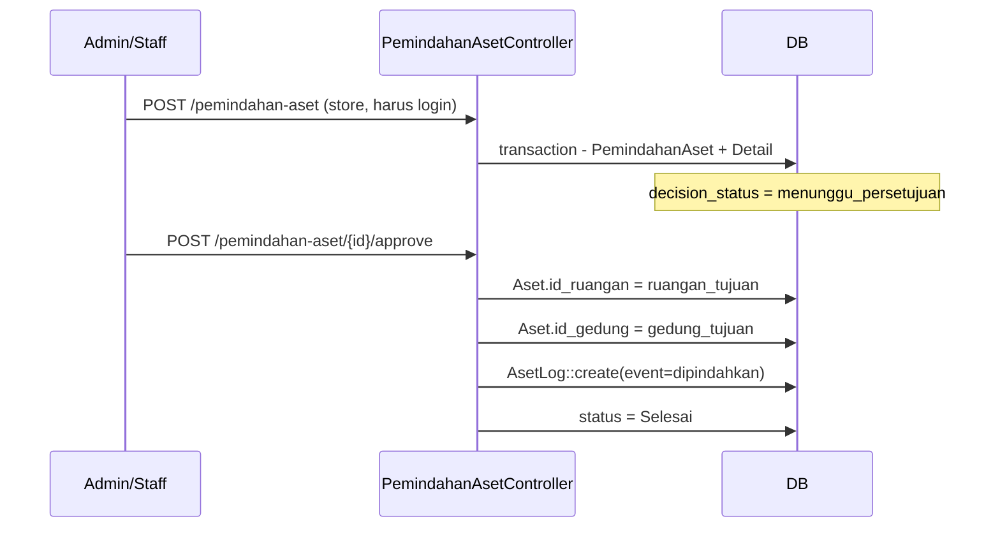

Pemindahan aset **tidak** mencatat realisasi RKAT (bukan pengeluaran).

---

## 7. Ekspedisi (Pengiriman Keluar)

**Controller**: `EkspedisiController`  
**Model**: `Ekspedisi`, `EkspedisiBarang`, `EkspedisiDokumen`, `EkspedisiPengiriman`

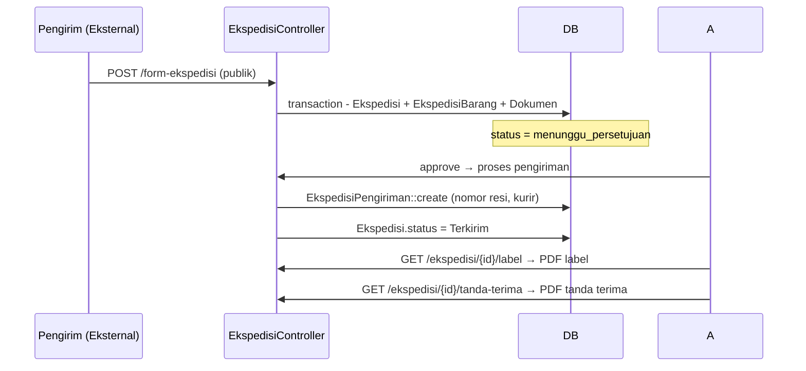

---

## 8. Pengaduan Kerusakan

**Controller**: `PengaduanKerusakanController`  
**Model**: `PengaduanKerusakan`, `PengaduanKerusakanDetail`

Form publik tanpa login. Admin menangani laporan dan menautkannya ke Maintenance jika perlu.

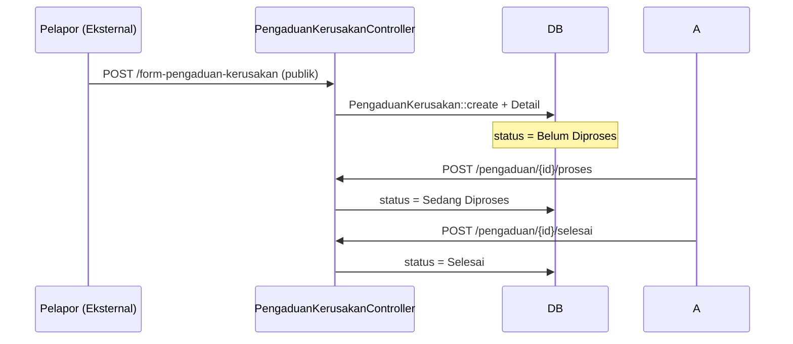

---

## 9. Maintenance

**Controller**: `MaintenanceController`  
**Model**: `Maintenance`, `MaintenanceDetail`

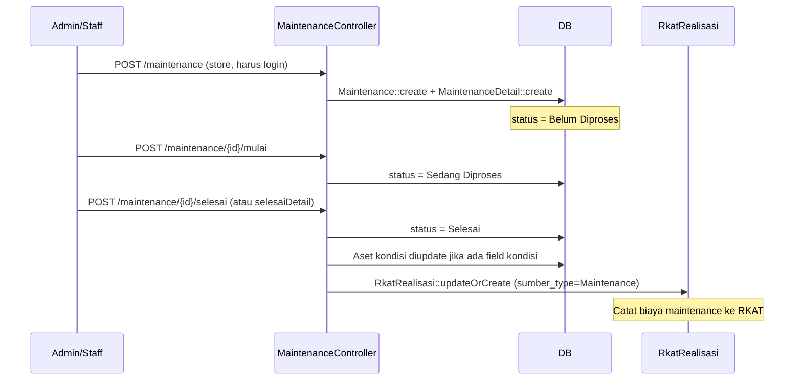

---

## 10. Stok Opname Gudang

**Controller**: `GudangController` — method `opname*()`  
**Model**: `GudangOpnameHeader`, `GudangOpnameDetail`

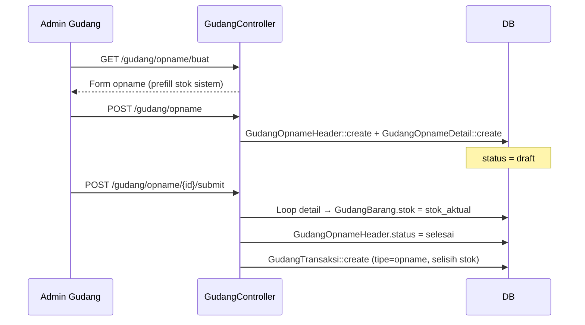

---

## 11. Transaksi Gudang (Masuk / Keluar)

**Controller**: `GudangController` — method `transaksiStore()`, `transaksiApprove()`  
**Model**: `GudangTransaksi`, `GudangTransaksiDetail`, `GudangTransaksiCharge`

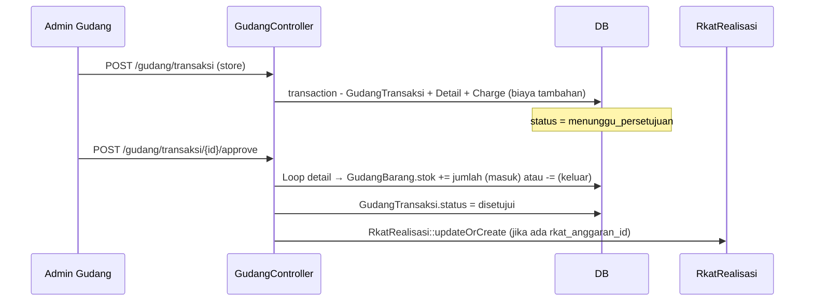

---

## 12. Laporan Pemusnahan Aset

**Controller**: `LaporanPemusnahanController`  
**Model**: `LaporanPemusnahan`

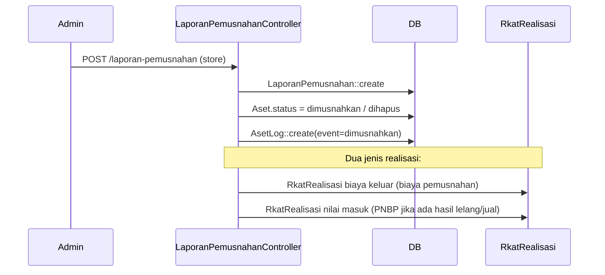

---

## 13. Rekap Bulanan Gudang (Scheduled Task)

**Command**: `php artisan rekap:bulanan`  
**Controller**: `GudangController::rekapBulan()`  
**Jadwal**: Otomatis tiap tanggal 1 jam 00:00

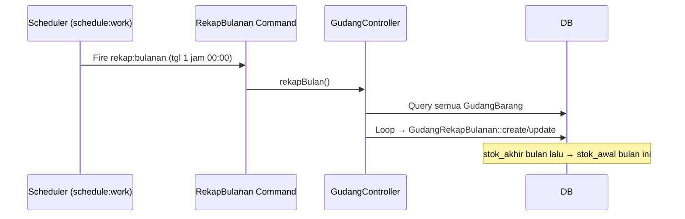

Bisa juga dipicu manual: `php artisan rekap:bulanan`.

---

## 14. Anggaran RKAT

**Controller**: `AnggaranController`  
**Model**: `RkatAnggaran`, `RkatRealisasi`

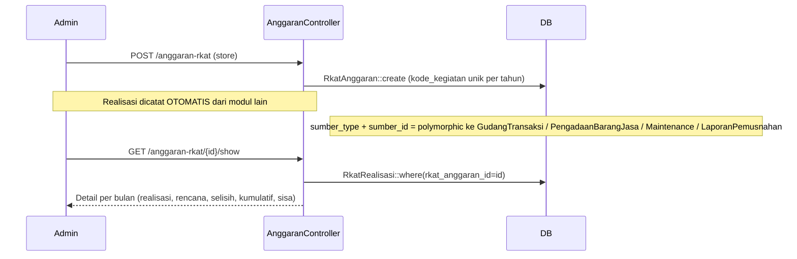

Realisasi **tidak dicatat manual oleh admin** — dicatat otomatis saat modul pengadaan/maintenance/gudang/pemusnahan diproses.

---

## 15. Form Publik — Keamanan

Semua form publik (tanpa login) dilindungi:

| Mekanisme | Implementasi |
|---|---|
| **Rate limiting** | `throttle:20,1` pada route POST publik — max 20 request/menit per IP |
| **CSRF** | Laravel default CSRF token di semua form |
| **Validasi input** | `$request->validate()` di controller — wajib sebelum insert DB |
| **Upload validation** | `mimes:jpg,jpeg,png,pdf` + `max:2048` (2MB) untuk file upload |
| **SQL Injection** | Eloquent ORM / parameter binding — tidak ada query raw tanpa binding |
| **XSS** | Blade `{{ }}` auto-escape; `{!! !!}` hanya untuk HTML yang sudah disanitasi |

> **[PERLU KONFIRMASI]** Tidak ada CAPTCHA di form publik — lihat [`07-pertanyaan-terbuka.md`](07-pertanyaan-terbuka.md) untuk risk assessment.
