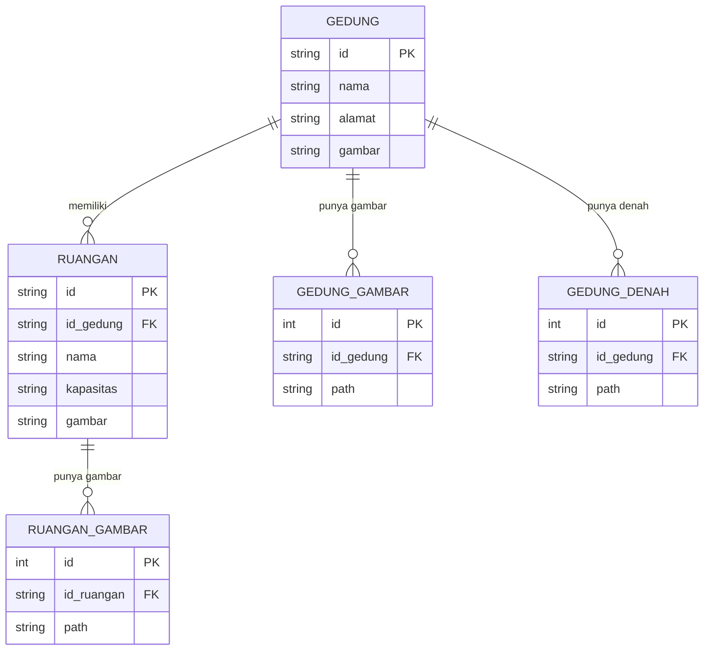
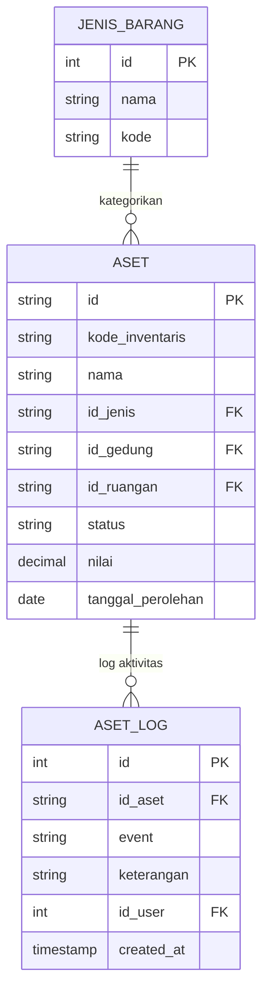
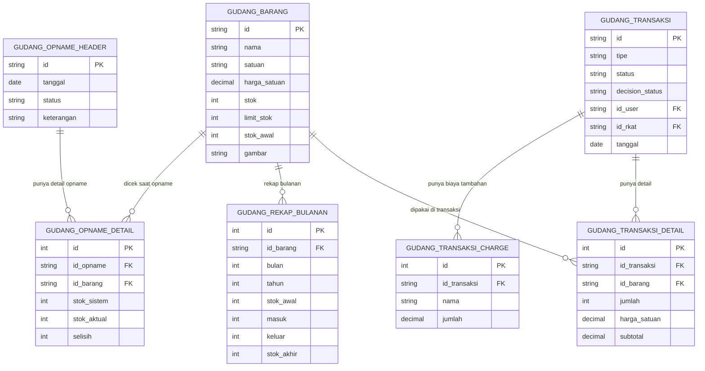
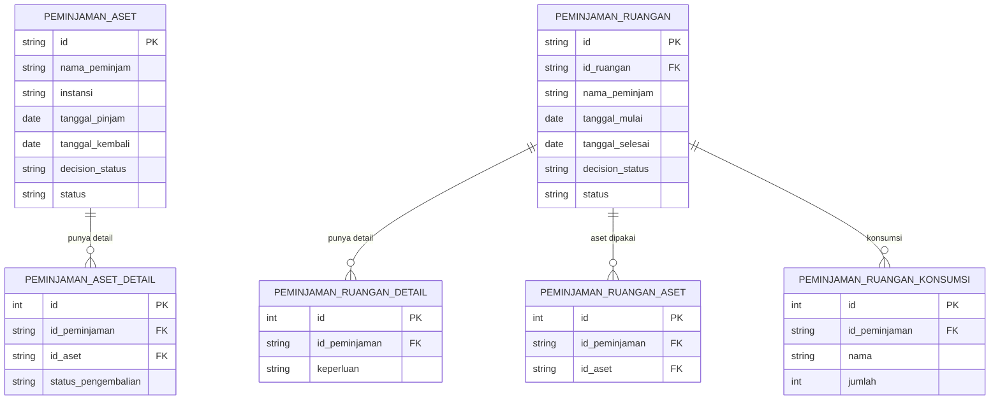
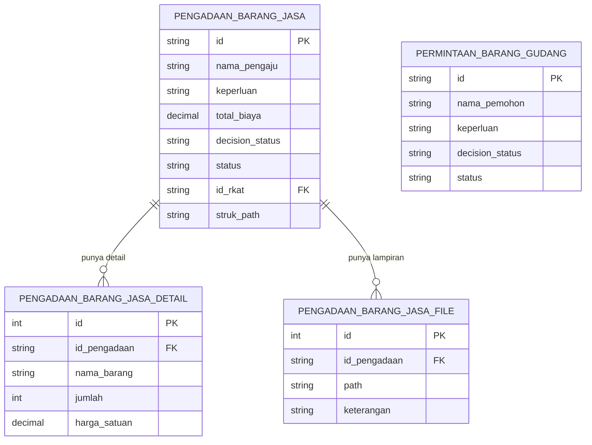
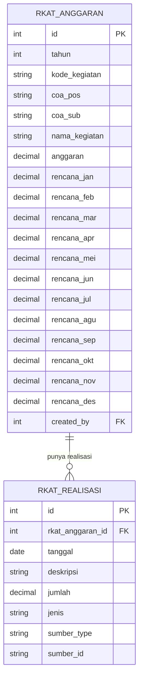
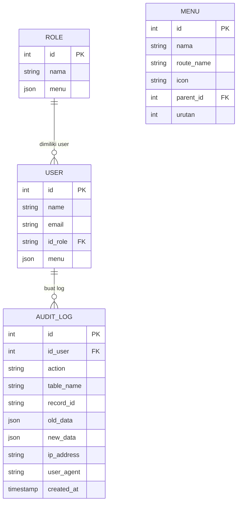

# 04 — Alur Data & ERD

## ERD per Modul

### Modul Infrastruktur



---

### Modul Aset Inventaris



---

### Modul Gudang



---

### Modul Peminjaman



---

### Modul Pengadaan & Permintaan



---

### Modul RKAT Anggaran



`sumber_type` + `sumber_id` adalah **polymorphic key** — menunjuk ke record sumber di tabel lain (contoh: `sumber_type = App\Models\GudangTransaksi`, `sumber_id = TRX-20260901-0001`).

---

### Modul RBAC & User



---

## Daftar Endpoint per Modul

Format: `[METHOD] /path` → `Controller::method()`

### Infrastruktur
```
GET    /gedung                           → GedungController::index
POST   /gedung                           → GedungController::store
GET    /gedung/{id}/edit                 → GedungController::edit
PUT    /gedung/{id}                      → GedungController::update
DELETE /gedung/{id}                      → GedungController::destroy
GET    /ruangan                          → RuanganController::index
POST   /ruangan                          → RuanganController::store
```

### Aset Inventaris
```
GET    /aset                             → AsetController::index
POST   /aset                             → AsetController::store
GET    /aset/{id}                        → AsetController::show
PUT    /aset/{id}                        → AsetController::update
DELETE /aset/{id}                        → AsetController::destroy
GET    /aset/export-excel                → AsetController::exportExcel
GET    /aset/export-pdf                  → AsetController::exportPdf
```

### Gudang
```
GET    /gudang                           → GudangController::index
POST   /gudang                           → GudangController::store (tambah barang)
PUT    /gudang/{id}                      → GudangController::update
DELETE /gudang/{id}                      → GudangController::destroy
GET    /gudang/transaksi                 → GudangController::transaksiIndex
POST   /gudang/transaksi                 → GudangController::transaksiStore
GET    /gudang/transaksi/{id}            → GudangController::transaksiDetail
POST   /gudang/transaksi/{id}/approve    → GudangController::transaksiApprove
GET    /gudang/opname                    → GudangController::opnameIndex
POST   /gudang/opname                    → GudangController::opnameStore
POST   /gudang/opname/{id}/submit        → GudangController::opnameSubmit
GET    /gudang/rekap                     → GudangController::rekapIndex
```

### Peminjaman Aset
```
GET    /form_peminjaman_aset             → PeminjamanAsetController::create (PUBLIK)
POST   /form_peminjaman_aset             → PeminjamanAsetController::store (PUBLIK)
GET    /cek-ketersediaan                 → PeminjamanAsetController::cekKetersediaan (AJAX)
GET    /peminjaman-aset                  → PeminjamanAsetController::index
GET    /peminjaman-aset/{id}             → PeminjamanAsetController::show
POST   /peminjaman-aset/{id}/approve     → PeminjamanAsetController::approve
POST   /peminjaman-aset/{id}/reject      → PeminjamanAsetController::reject
POST   /peminjaman-aset/{id}/serahkan    → PeminjamanAsetController::serahkanItem
POST   /peminjaman-aset/{id}/kembalikan  → PeminjamanAsetController::kembalikan
GET    /peminjaman-aset/export-pdf       → PeminjamanAsetController::exportPdf
```

### Peminjaman Ruangan
```
GET    /form-peminjaman-ruangan          → PeminjamanRuanganController::create (PUBLIK)
POST   /form-peminjaman-ruangan          → PeminjamanRuanganController::store (PUBLIK)
GET    /cek-ketersediaan-ruangan         → PeminjamanRuanganController::cekKetersediaanRuangan (AJAX)
GET    /peminjaman-ruangan               → PeminjamanRuanganController::index
POST   /peminjaman-ruangan/{id}/approve  → PeminjamanRuanganController::approve
POST   /peminjaman-ruangan/{id}/reject   → PeminjamanRuanganController::reject
```

### Permintaan & Pengadaan
```
GET    /form-permintaan-barang           → PermintaanBarangGudangController::create (PUBLIK)
POST   /form-permintaan-barang           → PermintaanBarangGudangController::store (PUBLIK)
GET    /permintaan-barang                → PermintaanBarangGudangController::index
POST   /permintaan-barang/{id}/approve   → PermintaanBarangGudangController::approve
POST   /permintaan-barang/{id}/proses    → PermintaanBarangGudangController::proses

GET    /form-pengadaan-barang            → PengadaanBarangJasaController::create (PUBLIK)
POST   /form-pengadaan-barang            → PengadaanBarangJasaController::store (PUBLIK)
GET    /pengadaan-barang                 → PengadaanBarangJasaController::index
GET    /pengadaan-barang/{id}            → PengadaanBarangJasaController::show
POST   /pengadaan-barang/{id}/approve    → PengadaanBarangJasaController::approve
POST   /pengadaan-barang/{id}/selesai    → PengadaanBarangJasaController::selesai
```

### Permintaan Kendaraan
```
GET    /form-permintaan-kendaraan        → PermintaanKendaraanController::create (PUBLIK)
POST   /form-permintaan-kendaraan        → PermintaanKendaraanController::store (PUBLIK)
GET    /cek-kendaraan                    → PermintaanKendaraanController::cekKetersediaan (AJAX)
GET    /permintaan-kendaraan             → PermintaanKendaraanController::index
POST   /permintaan-kendaraan/{id}/approve → PermintaanKendaraanController::approve
```

### Maintenance
```
GET    /maintenance                      → MaintenanceController::index
POST   /maintenance                      → MaintenanceController::store
GET    /maintenance/{id}                 → MaintenanceController::show
POST   /maintenance/{id}/mulai           → MaintenanceController::mulai
POST   /maintenance/{id}/selesai         → MaintenanceController::selesai
POST   /maintenance/{id}/detail/{did}/selesai → MaintenanceController::selesaiDetail
```

### Anggaran RKAT
```
GET    /anggaran-rkat                    → AnggaranController::index
POST   /anggaran-rkat                    → AnggaranController::store
PUT    /anggaran-rkat/{id}               → AnggaranController::update
DELETE /anggaran-rkat/{id}               → AnggaranController::destroy
GET    /anggaran-rkat/{id}/show          → AnggaranController::showRkat
GET    /riwayat-realisasi                → AnggaranController::indexRealisasi
POST   /riwayat-realisasi                → AnggaranController::storeRealisasi
DELETE /riwayat-realisasi/{id}           → AnggaranController::destroyRealisasi
```

### Admin
```
GET    /users                            → UserController::index
POST   /users                            → UserController::store
PUT    /users/{id}                       → UserController::update
DELETE /users/{id}                       → UserController::destroy
GET    /roles                            → RolesController::index
POST   /roles                            → RolesController::store
PUT    /roles/{id}                       → RolesController::update
GET    /menus                            → MenuController::index
POST   /menus                            → MenuController::store
GET    /audit-log                        → AuditLogController::index
```

### Vendor (Publik)
```
GET    /vendor/create                    → VendorController::create (PUBLIK)
POST   /vendor                           → VendorController::store (PUBLIK)
```

---

## Format ID (Primary Key)

Hampir semua tabel transaksional menggunakan string PK format `PREFIX-YYYYMMDD-NNNN`:

| Prefix | Modul | Contoh |
|---|---|---|
| `PJM` | Peminjaman Aset | `PJM-20260901-0001` |
| `PMR` | Peminjaman Ruangan | `PMR-20260901-0001` |
| `TRX` | Transaksi Gudang | `TRX-20260901-0001` |
| `EKS` | Ekspedisi | `EKS-20260901-0001` |
| `MNT` | Maintenance | `MNT-20260901-0001` |
| `PMD` | Pemindahan Aset | `PMD-20260901-0001` |
| `PNG` | Pengadaan Barang/Jasa | `PNG-20260901-0001` |
| `PKD` | Permintaan Kendaraan | `PKD-20260901-0001` |

Generator ada di `generateId()` di masing-masing controller. Pakai `lockForUpdate()` saat store untuk menghindari race condition (lihat [`07-pertanyaan-terbuka.md`](07-pertanyaan-terbuka.md) untuk analisis lengkap).

---

## Data Flow: Realisasi RKAT Otomatis

Realisasi RKAT dicatat dari 4 modul sumber:

```
GudangTransaksi::approve()
    → RkatRealisasi::updateOrCreate(sumber_type=GudangTransaksi, sumber_id=TRX-...)

PengadaanBarangJasa::selesai()
    → RkatRealisasi::updateOrCreate(sumber_type=PengadaanBarangJasa, sumber_id=PNG-...)

MaintenanceController::selesai() / selesaiDetail()
    → RkatRealisasi::updateOrCreate(sumber_type=Maintenance, sumber_id=MNT-...)

LaporanPemusnahanController::store()
    → RkatRealisasi biaya keluar (sumber_type=LaporanPemusnahan)
    → RkatRealisasi nilai masuk / PNBP (sumber_type=LaporanPemusnahan, jenis=masuk)
```

`updateOrCreate` memastikan jika transaksi yang sama di-reprocess, record realisasi diupdate (tidak duplikat).

---

## Audit Log — Semua Perubahan Data

Setiap insert/update/delete di model yang extend `BaseModel` otomatis tercatat di `audit_logs`:

| Field | Isi |
|---|---|
| `id_user` | User yang login saat itu (null jika dari console/queue) |
| `action` | `create` / `update` / `delete` |
| `table_name` | Nama tabel yang berubah |
| `record_id` | Primary key record yang berubah |
| `old_data` | JSON snapshot sebelum perubahan (null untuk create) |
| `new_data` | JSON snapshot setelah perubahan (null untuk delete) |
| `ip_address` | IP client |
| `user_agent` | Browser/client string |

`AuditLog` model sendiri **tidak** extend `BaseModel` — untuk menghindari infinite loop.
